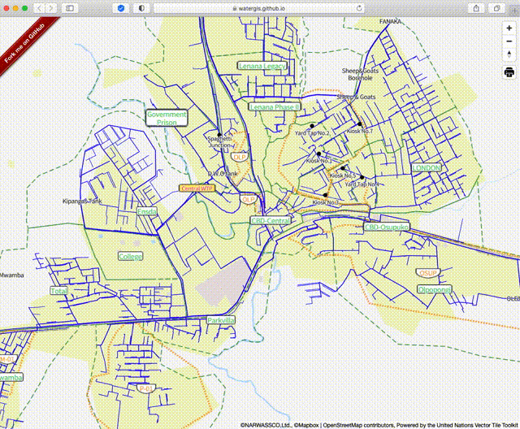

# mapbox-gl-export

[](https://www.npmjs.com/package/@watergis/mapbox-gl-export)

This module adds control which can export PDF and images.

This module is using source code of [mpetroff/print-maps](https://github.com/mpetroff/print-maps). I just adopted this library to normal Mapbox GL Plugin. Thanks so much to develop this library!

## for Maplibre GL users

Please consider to use [maplibre-gl-export](https://github.com/watergis/maplibre-gl-export) plugin for Maplibre GL.

## Installation

```bash
npm i @watergis/mapbox-gl-export --save
```

## Use CDN

import JS and CSS from CDN.

- from unpkg.com

```html
<link href="https://www.unpkg.com/@watergis/mapbox-gl-export@3.0.4/dist/mapbox-gl-export.css" rel="stylesheet" />
<script src="https://www.unpkg.com/@watergis/mapbox-gl-export@3.0.4/dist/mapbox-gl-export.umd.js"></script>
```

- from jsdelivr

```html
<link href="https://cdn.jsdelivr.net/npm/@watergis/mapbox-gl-export@3.0.4/dist/mapbox-gl-export.css" rel="stylesheet" />
<script src="https://cdn.jsdelivr.net/npm/@watergis/mapbox-gl-export@3.0.4/dist/mapbox-gl-export.umd.js"></script>
```

See the sample code of [html](./index_cdn.html) and [JS](./index_cdn.js).

Alternatively, you can use `latest` tag for CDN instead of specific version (But any breaking changes may be in the future).

## Demo

Try [codesandbox](https://codesandbox.io/s/mapbox-gl-export-8x4lw?file=/src/index.ts).

See [demo](https://watergis.github.io/mapbox-gl-export/#12/-1.08551/35.87063).



## Usage

```ts
import { MapboxExportControl, Size, PageOrientation, Format, DPI} from "@watergis/mapbox-gl-export";
import '@watergis/mapbox-gl-export/dist/mapbox-gl-export.css';
import mapboxgl from 'mapbox-gl';

const map = new mapboxgl.Map();
// create control with default options
map.addControl(new MapboxExportControl(), 'top-right');
// create control with specified options
map.addControl(new MapboxExportControl({
    PageSize: Size.A3,
    PageOrientation: PageOrientation.Portrait,
    Format: Format.PNG,
    DPI: DPI[96],
    Crosshair: true,
    PrintableArea: true
}), 'top-right');
```

### if you want to use a basemap from Mapbox

- for mapbox v1 user

```ts
mapboxgl.accessToken='your mapbox access token'
```

- for mapbox v2 user
There is an option of `accessToken` in `MapboxExportControl`. Please put your accessToken when you create a instance of plugin.

```ts
mapboxgl.accessToken='your mapbox access token'
const map = new mapboxgl.Map({
    container: 'map',
    style: 'mapbox://styles/mapbox/streets-v11',
});
map.addControl(new MapboxExportControl({
    accessToken: 'your mapbox access token'
}), 'top-right');
```

### Options

You can specify default option as follows.

- PageSize
  - You can select from `A2` to `A6` or `B2` to `B6`
  - default page size is `A4`
- PageOrientation
  - You can select `landscape` or `portrait`
  - default is `landscape`
- Format
  - You can select it from `jpg`, `png`, `svg` and `pdf`
  - default is `PDF`
- DPI
  - You can select it from `72`, `96`, `200`, `300` and `400`.
  - default is `300`
- Crosshair
  - Display crosshair on the map. it helps to adjust the map center before printing.
  - accepts `true` and `false` value
  - default is `false`
- PritableArea
  - Display printable area on the map it helps to adjust pritable area before printing.
  - accepts `true` and `false` value
  - default is `false`
- Local
  - default `en` for english
  - `de` german
  - `fr` french
  - `fi` finnish
  - `sv` swedish
  - `es` spanish
  - `vi` Vietnam
  - `uk` Ukranian
  - `zhHans` Chinese Simplified
  - `zhHant` Chinese Traditional
  - `ja` Japanese
- AllowedSizes
  - list of allowed page sizes for export
  - available values `'LETTER'`, `'A2'`, `'A3'`, `'A4'`, `'A5'`, `'A6'`, `'B2'`, `'B3'`, `'B4'`, `'B5'`, `'B6'`
  - default: all sizes `['LETTER','A2','A3','A4','A5','A6','B2','B3','B4','B5','B6']`
- Filename
  - file name template, file part
  - default `map` for i.e `map.pdf`
- markerCirclePaint: The plugin will convert marker SVG to circle layer to be exported.
  - Circle paint property setting. As default, the following paint setting will be applied

```json
{
  "circle-radius": 8,
  "circle-color": "red",
  "circle-stroke-width": 1,
  "circle-stroke-color": "black"
}
```

## Attribution

When you use exported map, please includes attribution as follows.

If you can include HTML, use this code snippet that includes links to Mapbox & OpenStreetMap:

```html
© NARWASSCO, Ltd. © <a href='https://www.mapbox.com/about/maps/'>Mapbox</a> © <a href='https://www.openstreetmap.org/copyright'>OpenStreetMap</a> <strong><a href='https://www.mapbox.com/map-feedback/' target='_blank'>Improve this map</a></strong>Powered by the United Nations Vector Tile Toolkit
```

For print output or if you can’t include links, use this text-only attribution:

```
© NARWASSCO, Ltd. ©Mapbox ©OpenStreetMap contributors, Powered by the United Nations Vector Tile Toolkit
```

`© NARWASSCO, Ltd.` is default example of map data by `Narok Water and Sewerage Services Co., Ltd.`, Kenya. If you don't use current map, you don't need to use this attribution.

Also, default example is using base map by United Nation Vector Tile Toolkit. That is why `Powered by the United Nations Vector Tile Toolkit` is included in above.

## Development

```bash
pnpm lint
pnpm format
pnpm dev
```

open [http://localhost:5173](http://localhost:5173).

If there are any changes on source code, it will be reflected automatically.

## Build package

```
pnpm build
```

The modules will be generated under `dist` folder.
