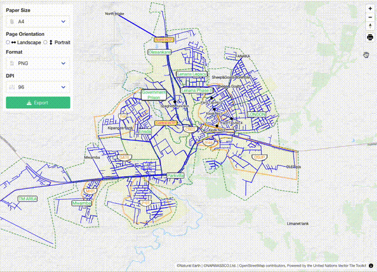

# svelte-maplibre-export


This is a svelte component to add export control to maplibre.



## Install

```zsh
npm i @watergis/svelte-maplibre-export
```

or

```zsh
yarn add @watergis/svelte-maplibre-export
```

## Usage

See [Example](./src/example).

```svelte
<script lang="ts">
  import MapExportControl from '@watergis/svelte-maplibre-export/MapExportControl.svelte';
  import MapExportPanel from '@watergis/svelte-maplibre-export/MapExportPanel.svelte';

  // create maplibre.Map object
  let map = new Map();

</script>

<div class="map" id="map" bind:this={mapContainer}>
    <div class="export-container">
        <!-- if you would like to use just a part of export tool, use this option -->
        <MapExportPanel bind:map={$map} showPrintableArea={false} showCrosshair={false} />
    </div>
</div>

<!-- if you would like to add an export tool as maplibre plugin, use this option -->
<MapExportControl bind:map={$map} showPrintableArea={true} showCrosshair={true} position='top-right' />

<style>
.export-container {
    position: absolute;
    top: 10px;
    left: 10px;
    z-index: 10;
}
</style>
```

## create-svelte

Everything you need to build a Svelte project, powered by [`create-svelte`](https://github.com/sveltejs/kit/tree/master/packages/create-svelte).

### Creating a project

If you're seeing this, you've probably already done this step. Congrats!

```bash
# create a new project in the current directory
npm create svelte@latest

# create a new project in my-app
npm create svelte@latest my-app
```

### Developing

Once you've created a project and installed dependencies with `npm install` (or `pnpm install` or `yarn`), start a development server:

```bash
npm run dev

# or start the server and open the app in a new browser tab
npm run dev -- --open
```

### Building

To create a production version of your app:

```bash
npm run build
```

You can preview the production build with `npm run preview`.

> To deploy your app, you may need to install an [adapter](https://kit.svelte.dev/docs/adapters) for your target environment.
